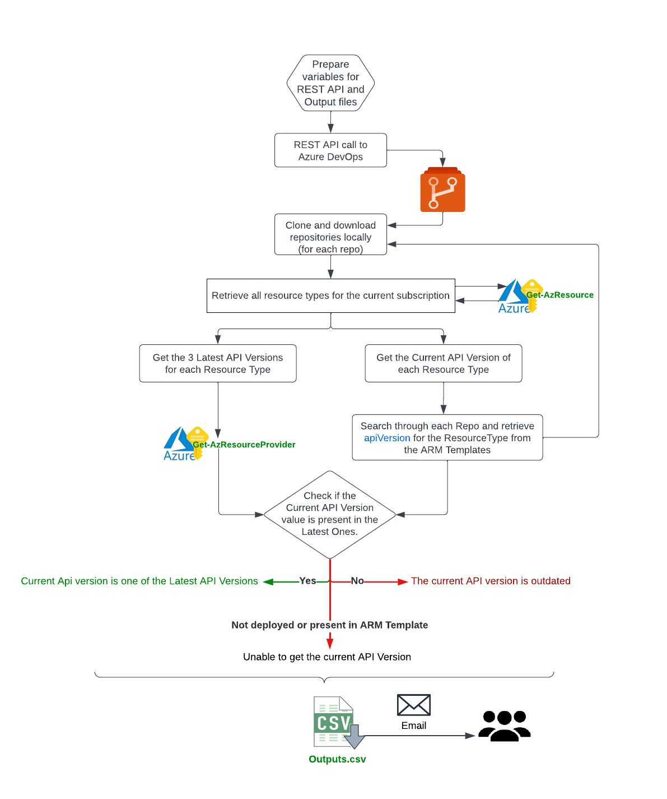

# Overview 

This script retrieves the latest and current API versions of the Azure resources deployed in a specified GC subscription. 
The script uses Azure PowerShell and Azure DevOps REST APIs to perform the following steps:

- Get the list of repositories under the provided Azure DevOps (AzDO) project and clone/download them locally.
- Search for all files containing "deploy" or "template" in their names and extract the resource type and API version information from each file's JSON content.
- Retrieve the latest 3 API versions for each resource type in the current subscription and compare them to the current API version retrieved from the previous step.
- Lastly, export the results to a CSV file.

# Prerequisites

Before running the script, the following prerequisites must be met:

1. Azure PowerShell module must be installed on the machine where the script will be executed.
2. The Azure DevOps Personal Access Token (PAT) must be obtained and provided as an input parameter to the script. The PAT must have the necessary permissions to access the AzDO project and repositories.
3. The script must be executed on a machine where Git is installed.

# Inputs

The script initializes the following variables:

- $orgUrl: The URL of the Azure DevOps organization.
- $pat: The Personal Access Token (PAT) used for authentication.
- $projectName: The name of the Azure DevOps project.
- $outputFolder: The path to the output folder where the script clones the Azure DevOps project repositories.
- $outputFile: The path to the output file where the script writes the extracted type and apiVersion from each file's JSON content.
- $outputFileAPI: The path to the output file where the script removes whitespaces after the APIVersion.
- $outputFileAPITmp: The path to the temporary output file where the script writes the extracted type and apiVersion from each file's JSON content to remove duplicates.
- $outputFileCSV: The path to the output CSV file where the script exports the results.

# Usage

The script can be either ran manually or via Azure DevOps Pipelines or GitHub Workflows.

1. To run using PowerShell manually, just run the below command:
```
.\Get-AzResourceAPIVersions.ps1 -pat <Azure DevOps PAT> -outputFileCSV <Output CSV file path>
```
  Make sure to replace <Azure DevOps PAT> with the Azure DevOps Personal Access Token and <Output CSV file path> with the path to the output CSV file.
2. To run using Azure DevOps Pipelines, you can use the [azure-pipelines.yml](./azure-pipelines.yml) file as a reference and modify the variables wherever required. 
  
# Outputs
  
The script generates the following output:

- Console output: The script outputs the latest 3 API versions for each resource type and the status of the current API version (outdated, latest, or unable to determine) to the console.
- CSV file: The script exports the results to a CSV file containing the following columns:
  1. ResourceType: The Azure resource type.
  2. LatestApiVersion: The latest 3 API versions for the resource type.
  3. CurrentApiVersion: The current API version for the resource type.
  4. Status: The status of the current API version (outdated, latest, or unable to determine).  
  
# Flow Chart

  
  
  
  
